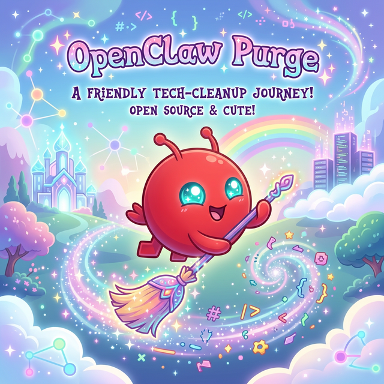

# OpenClaw Purge

<p align="center">
  
</p>

Open-source, auditable, one-command removal scripts for OpenClaw.

This repository is intended for public use: clone it, review the scripts, run a dry-run first, then remove OpenClaw completely from the local machine that is actually hosting it.

The current behavior is aligned with the official OpenClaw uninstall guide and keeps the same two-path model: easy path when the CLI still exists, manual cleanup when the service is still present but the CLI is gone.

## What This Repo Does

- Stops and unregisters local OpenClaw gateway services.
- Removes local state directories such as `~/.openclaw` and discovered profile directories like `~/.openclaw-*`.
- Tries to uninstall the global OpenClaw CLI from `npm`, `pnpm`, or `bun`.
- Removes common desktop-app leftovers for macOS and Windows.
- Can optionally remove an explicitly provided OpenClaw source checkout path in the same order described by the official docs.
- Offers an optional `--aggressive` / `-Aggressive` scan that only searches known app-data roots for names containing `openclaw`.

## What This Repo Does Not Do

- It does not remove a remote gateway from your local machine. If OpenClaw was running on another host, run the cleanup script on that host.
- It does not guess arbitrary source checkout locations and delete them automatically. You must pass them explicitly.
- It does not require `sudo`, and it intentionally avoids system-wide destructive behavior by default.

## Quick Start

### macOS / Linux

```bash
chmod +x ./bin/openclaw-purge.sh
./bin/openclaw-purge.sh --dry-run
./bin/openclaw-purge.sh --yes
```

Aggressive cleanup:

```bash
./bin/openclaw-purge.sh --yes --aggressive
```

If the local CLI is already missing but you still want to try the official `npx` uninstall path first:

```bash
./bin/openclaw-purge.sh --yes --allow-npx
```

If OpenClaw was run from a cloned repo and you want this tool to delete that checkout too:

```bash
./bin/openclaw-purge.sh --yes --repo-path ~/src/openclaw
```

### Windows

```powershell
powershell -ExecutionPolicy Bypass -File .\windows\openclaw-purge.ps1 -DryRun
powershell -ExecutionPolicy Bypass -File .\windows\openclaw-purge.ps1 -Yes
```

Aggressive cleanup:

```powershell
powershell -ExecutionPolicy Bypass -File .\windows\openclaw-purge.ps1 -Yes -Aggressive
```

Optional `npx` fallback and explicit source-checkout removal:

```powershell
powershell -ExecutionPolicy Bypass -File .\windows\openclaw-purge.ps1 -Yes -AllowNpx
powershell -ExecutionPolicy Bypass -File .\windows\openclaw-purge.ps1 -Yes -RepoPath C:\src\openclaw
```

## Default Removal Flow

1. If the `openclaw` CLI is still available, run its built-in uninstall command first.
2. Stop and unregister local gateway services.
3. Remove known state, workspace, profile, and desktop-app paths.
4. Try to uninstall globally installed CLI packages.
5. Optionally scan known app-data roots for leftover paths containing `openclaw`.

## Official Flow Mapping

The scripts mirror the official uninstall guide:

1. Easy path: `openclaw uninstall --all --yes --non-interactive`
2. Optional automation fallback: `npx -y openclaw uninstall --all --yes --non-interactive`
3. Manual service cleanup:
   macOS: `launchctl` + `~/Library/LaunchAgents/ai.openclaw*.plist` and legacy `com.openclaw*.plist`
   Linux: `systemctl --user` + `~/.config/systemd/user/openclaw-gateway*.service`
   Windows: Scheduled Tasks named `OpenClaw Gateway*` plus `gateway.cmd`
4. State cleanup: default state dir, optional external config, workspace, and every `~/.openclaw-*` profile
5. Optional source-checkout removal only when the user explicitly passes `--repo-path` / `-RepoPath`

## Remote And Source Modes

- Remote mode: if the gateway is on another machine, run the service/state cleanup there too. Local cleanup alone is not sufficient.
- Source checkout: official guidance is to uninstall the service first, then delete the repo, then delete state/workspace. This repo follows that order when `--repo-path` / `-RepoPath` is provided.
- Profiles: profile-specific state dirs such as `~/.openclaw-foo` are removed automatically.

## Safety Model

- Confirmation is required by default unless `--yes` or `-Yes` is passed.
- `--dry-run` / `-DryRun` prints every planned action without deleting anything.
- The scripts only target user-level paths and explicit OpenClaw patterns.
- Aggressive mode is opt-in.
- The scripts do not delete themselves.

## Known Targets

The removal targets are documented in [docs/known-targets.md](docs/known-targets.md).

The official uninstall document is here: [docs.openclaw.ai/install/uninstall](https://docs.openclaw.ai/install/uninstall).

## Repository Layout

- [bin/openclaw-purge.sh](bin/openclaw-purge.sh): macOS/Linux cleanup script
- [windows/openclaw-purge.ps1](windows/openclaw-purge.ps1): Windows cleanup script
- [docs/known-targets.md](docs/known-targets.md): documented paths and labels

## Publishing Notes

- Rename the repository to whatever public name you want, for example `openclaw-purge`.
- Add a release tag and attach the scripts directly so people can download them without cloning.
- If you publish raw download URLs later, update this README with your real GitHub owner/repo path.

## License

[MIT](LICENSE)
